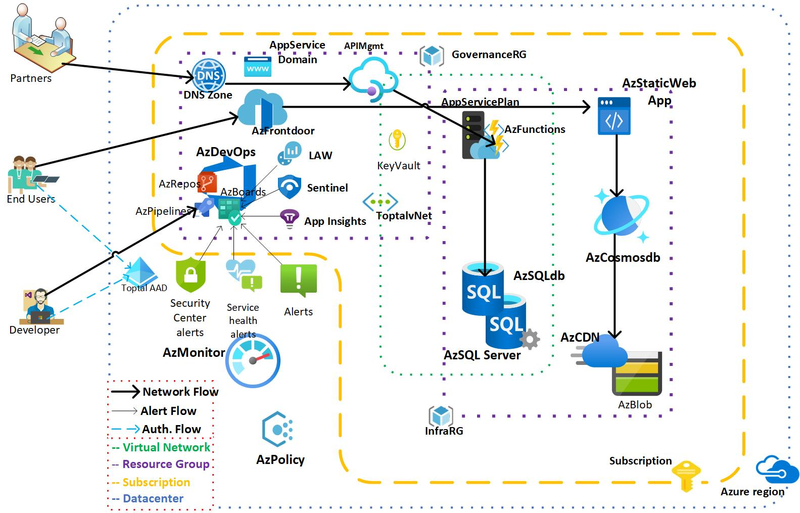

This is a design for a secure and scalable e-commerce webapp for a retail startup in Azure. With Azure Functions and Web Apps, so you can create personalized experiences while Azure takes care of the infrastructure.

## <u>Architecture</u>

<u>**Physical**</u> diagram for the Azure Resources in line with industry standards and Microsoft recommendations. The more detailed diagram for the logical components of the application would need to be created by the application developers.

<u>Design decisions</u>

1. **Authentication**: Both developers and end users will authenticate against Azure AD. The developers would back in their code into an AzDevops repository after being authorized. And the end users will go through FrontDoor and consume Cosmos DB in the back end. Partners can consume API’s hosted on AzFunctions thru API management.

2. **NoSQL database**: Cosmos DB will need to be configured with a [global distribution Consistency level][2] configuration that is in line with the application's requirements.

3. **Alert Operations flow**: This document defines the infrastructure operations for this software. The actual agile methodology for developers to test and check in code into the Azure repository would need to be worked out along with the application owner and the project managers.This also demonstrates to the investors how we are operationalizing security alerts and what the plan would be in case of a breach based on industry standards and Microsoft recommendations.

4. **Static WebApp**: Avoiding a middleware would enable scaling the application for millions of users across continents.

5. **API Management**: The sensitive data that are exposed from API endpoints would be accessible for partners through Azure API management. And partners would be issued their own API keys for protection.

6. **Azure Alerts**: Security center alerts and service health alerts are specific Azure monitoring components that would enable the company to respond to attacks in the long term.

Dataflow

1. User accesses the web app in browser and signs in.
2. Browser pulls static resources such as images from Azure Content Delivery Network.
3. User searches for products and queries SQL database.
4. Web site pulls product catalog from Cosmosdb.
5. Web app pulls product images from the CDN connected to Blob Storage.

Components

|   |   |
|---|---|
| [Static WebApps][3] | Build modern web applications that automatically publish to the web as your code changes.     |
| [Functions][4]      | Process events with serverless code     |

|   |   |
|---|---|
| [SQL Database][5] | Managed, intelligent SQL in the cloud     |
| [Blob Storage][6] | Azure Blob Storage is Microsoft's object storage solution for the cloud.     |
| [Cosmos DB][7]    | Fully managed NoSQL and relational database for modern app development.     |

|   |   |
|---|---|
| [AppService Domain][8]      | App Service Domain is a domain resource on Azure which integrates with Azure DNS.     |
| [Azure DNS][9]      | Azure DNS is a hosting service for DNS domains that provides name resolution.     |
| [FrontDoor & CDN][10]      | Azure Front Door is Microsoft’s modern cloud Content Delivery Network.     |
| [Virtual Network][11]      | Virtual Network (VNet) is the fundamental building block for your private network in Azure.     |
| [API Management][12]     | Azure API Management is a hybrid, multicloud management platform for APIs across all environments.     |

|   |   |
|---|---|
| [Key Vault][13]      | Azure Key Vault is one of several key management solutions in Azure.     |
| [Policy][14]      | Azure Policy helps to enforce organizational standards and to assess compliance at-scale.     |
| [Active Directory][15]      | Azure Active Directory (Azure AD) is a cloud-based identity and access management service.

|   |   |
|---|---|
| [Application Insights][16]      | Detect, triage, and diagnose issues in your web apps and services     |
| [Sentinel][17]      | Security information and event management (SIEM) and Security orchestration, automation, and response (SOAR)     |
| [Log Analytics workspace][18]      | Unique environment for log data from Azure Monitor and other Azure services     |
| [Defender Alerts][19]      | Security alerts are the notifications generated by Defender for Cloud and Defender for Cloud plans when threats are identified in your cloud     |
| [Service Health Alerts][20]      | Azure offers a suite of experiences to keep you informed about the health of your cloud resources.     |

|   |   |
|---|---|
| [AzDevOps Organization][21]     | Use an organization to connect groups of related projects, and help to scale up your enterprise.     |
| [AzDevOps Project][22]     | Establish a repository for source code and to plan and track work.     |
| [AzDevOps Repository][23]     | Manage your source code as your project grows.     |
| [Azure Pipelines][24]      | It supports all major languages and project types and combines continuous integration, continuous delivery, and continuous testing to build, test, and deliver your code to any destination.     |

<u>**Author**</u>: [Ayan Mullick][32] | PowerShell Lead| Azure Consultant| Delivery Architect| Solopreneur

Next steps

* Identify [tenant][25] and non-production [subscription][26]
* Create ADO [Organization][21], [Project][22], [Repository][23] and [Work items][27].
* Use [Azure PowerShell modules][28] in an [ADO Pipeline][29] to build the infrastructure.
* [Build an ASP.NET app in Azure with SQL Database][30]
* [Learn what can you do with Azure Functions][31]

[2]: <https://learn.microsoft.com/en-us/azure/cosmos-db/consistency-levels>
[3]: <https://learn.microsoft.com/en-us/azure/static-web-apps>
[4]: <https://azure.microsoft.com/services/functions>
[5]: <https://azure.microsoft.com/services/sql-database>
[6]: <https://learn.microsoft.com/en-us/azure/storage/blobs>
[7]: <https://learn.microsoft.com/en-us/azure/cosmos-db>
[8]: <https://azure.github.io/AppService/2021/09/22/2021-Managing-ASD.html>
[9]: <https://learn.microsoft.com/en-us/azure/dns>
[10]: <https://learn.microsoft.com/en-us/azure/frontdoor>
[11]: <https://learn.microsoft.com/en-us/azure/virtual-network>
[12]: <https://learn.microsoft.com/en-us/azure/api-management>
[13]: <https://learn.microsoft.com/en-us/azure/key-vault/general>
[14]: <https://learn.microsoft.com/en-us/azure/governance/policy>
[15]: <https://learn.microsoft.com/en-us/azure/active-directory/fundamentals>
[16]: <https://learn.microsoft.com/en-us/azure/azure-monitor/app/app-insights-overview>
[17]: <https://learn.microsoft.com/en-us/azure/sentinel/overview>
[18]: <https://learn.microsoft.com/en-us/azure/azure-monitor/logs/log-analytics-workspace-overview>
[19]: <https://learn.microsoft.com/en-us/azure/defender-for-cloud/alerts-overview>
[20]: <https://learn.microsoft.com/en-us/azure/service-health/overview>
[21]: <https://learn.microsoft.com/en-us/azure/devops/organizations/accounts/create-organization>
[22]: <https://learn.microsoft.com/en-us/azure/devops/organizations/projects/create-project>
[23]: <https://learn.microsoft.com/en-us/azure/devops/repos/git/create-new-repo>
[24]: <https://learn.microsoft.com/en-us/azure/devops/pipelines/get-started/what-is-azure-pipelines>
[25]: <https://learn.microsoft.com/en-us/azure/active-directory/develop/quickstart-create-new-tenant>
[26]: <https://learn.microsoft.com/en-us/microsoft-365/enterprise/subscriptions-licenses-accounts-and-tenants-for-microsoft-cloud-offerings?view=o365-worldwide>
[27]: <https://learn.microsoft.com/en-us/azure/devops/boards/work-items/view-add-work-items?view=azure-devops&tabs=browser#open-work-items>
[28]: <https://learn.microsoft.com/en-us/powershell/azure>
[29]: <https://learn.microsoft.com/en-us/azure/devops/pipelines/tasks/reference/powershell-v2>
[30]: <https://learn.microsoft.com/en-us/azure/app-service/app-service-web-tutorial-dotnet-sqldatabase>
[31]: <https://learn.microsoft.com/en-us/azure/azure-functions/functions-overview>
[32]: <https://www.linkedin.com/in/ayanmullick>
